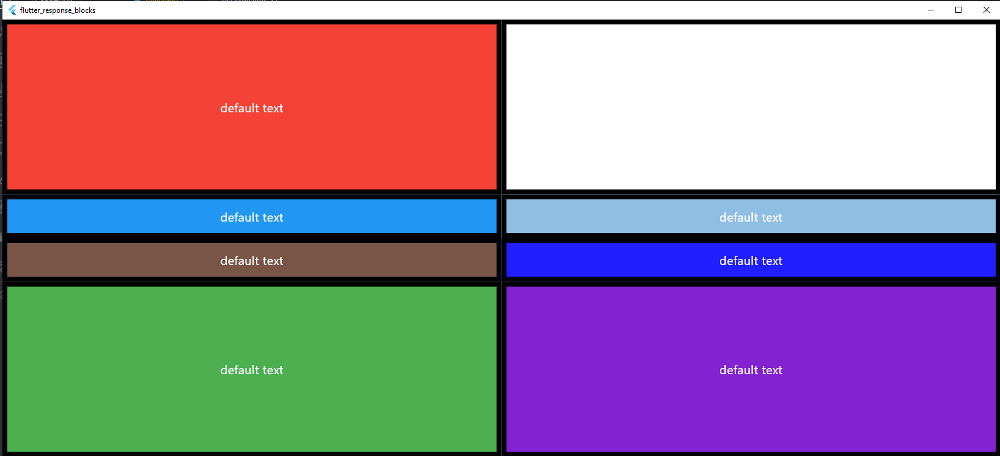
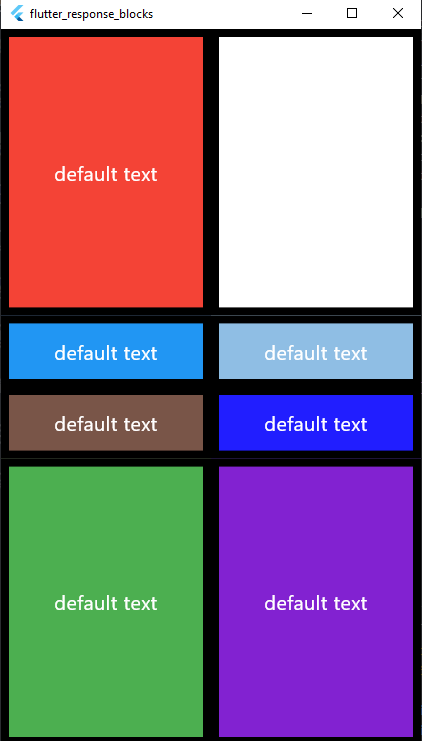

# Флаттер приложение 
Работа с Expanded был создан виджет CustomExpanded для настройки 
```flutter 
class CustomExpended extends StatelessWidget {
  final Color color;
  final Color textColor;
  final String text;
  final int flex;
  const CustomExpended(
      {super.key,
      required this.color,
      required this.flex,
      this.text = 'default text',
      this.textColor = Colors.white});
  @override
  Widget build(BuildContext context) {
    return Expanded(
        flex: flex,
        child: Container(
          decoration: BoxDecoration(
              color: color,
              border: Border.all(color: Colors.black, width: 8.0)),
          width: double.infinity,
          child: Center(
            child: Text(
              '$text',
              style: TextStyle(
                color: textColor,
                fontSize: 20.0,
              ),
              textAlign: TextAlign.center,
            ),
          ),
        ));
  }
}
```

## Результат


